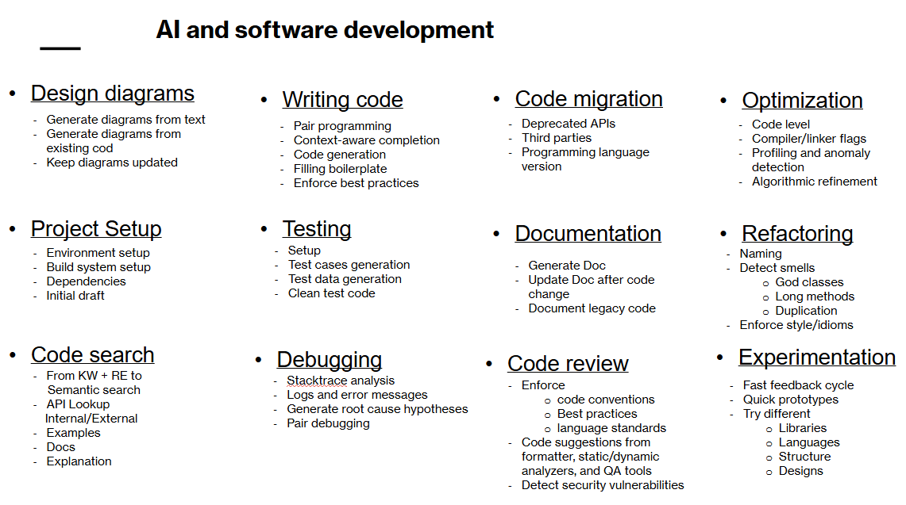
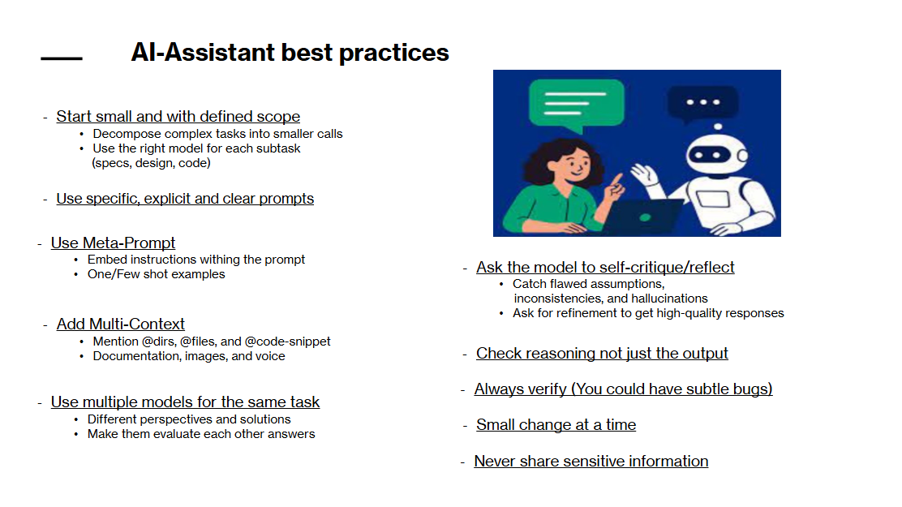
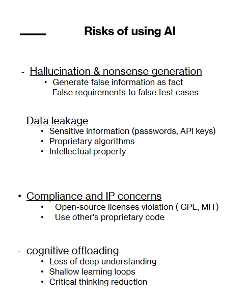

Software engineering is a branch of both computer science and engineering focused on the design, implementation, and maintenance of software systems. It develops software systems by applying engineering principles and computer programming expertise to meet user needs.

Computer Science
--------------
```
CS fundemntals are so important for any software engineer to have a solid foundation in them.
All technologies are built on top of these fundemntals for different needs.
```

* Mathematics
* Database
* Operating Systems
* Algorithms and Data Structures
* Computer Networks
* Programming Languages

Software Engineering
------------------
```
Software Engineering is the application of engineering principles to the design, implementation, testing,
and maintenance of software systems.
```
```
A software system is a living being, it has a lifecycle, it has a birth, it has a growth, it has a maturity, it has a decline, and it has a death.<br>
It goes through different stages and it has different needs at different stages.
being aware of that is important even if you are not involved in each stage of the software development lifecycle (SDLC).
```

software development life cycle (SDLC)
----------------------------------
* ### Software requirements
    * **Requirements analysis**
        * ***functional requirements***
        * ***Non-functional requirements (Quality attributes)***
            * Availability
            * Scalability
            * Maintainability
            * Reliability
            * etc
       * ***Requirements specification***
       * ***Requirements Documentation***
       * ***Tools:*** 
          * Polarion
          * Markdown
          * Confluence

* ### Software design
    * **Architecture types**
        * Monolithic
        * Component based
        * Layered
        * Microservices
        * Serverless
        * Event Driven
        * Domain Driven
    * **High Level Design**
        * 4+1 Model
        * C4 Model
    * **Low Level Design**
        * Class Diagrams
        * Sequence Diagrams
        * Activity Diagrams
        * State Diagrams
    * **Concepts and patterns**
        * Modularity
        * Encapsulation
        * Abstraction
        * Inheritance
        * Polymorphism
        * Composition
        * Aggregation
        * Association
        * Dependency
        * SOLID Principles
            * Single Responsibility
            * Open/Closed
            * Liskov Substitution
            * Interface Segregation
            * Dependency Inversion
        * DRY principle
        * Design Patterns
            * Creational
            * Structural
            * Behavioral
    * **Tools:** 
        * Markdown 
        * UML
        
* ### Software implementation
    * **Programming Language**
        * ***System: Performance & efficiency*** 
            * C/C++/Rust
        * ***Scripting: Exprimentation & Productivity***
            * Python/Ruby
    * **Project Setup**
        * ***Dependencies***
            * Reusability
                * Packagers
                    * Python (Pip)/ C++ (VcPkg/Hunter)
                * Build & Use
                    * Python (Pip install) / C++ (CMake build)
    * **Design Realization**
        * ***Language Idioms***
        * ***Code Conventions***
        * ***Anti-patterns avoidance***
        * ***API contract documentation***
            * Doxygen > C++/C
            * DocTest > Python
        * ***Small functional units***
        * ***Small Changes and Verify***
        * ***Data Validation***
        * ***Unit Testing***
            * GoogleTest > C++
            * PyTest > Python
        * ***Debugging***
            * Logging
            * Assertions
            * Checkpoints
            * Watchpoints
            * Core Dumps
            * Static Analysers
            * dynamic Analysers
            * Tools:
                * GDB/PDB
                * logging libraries
                * Hardware JTAG/Serial Debuggers
                * Valgrind
        * ***Version Control***
            * Tools:
                * Git/Mercurial 
        * ***Code Review***
            * Tools:
                * Github/GitLab/BitBucket
    * ***Concepts***
        * TDD (Test Driven Development) (Red-Green-Refactor)
        * BDD (Behavior Driven Development)
        * Language Bindings
        * API backward/forward compatability
        * API deprication
        * Migration
        * Compatability Matrix
        * Interface contract
        
* ### Software testing
    * **Test Paradigm**
        * TDD (Test Driven Development) (Red-Green-Refactor)
        * BDD (Behavior Driven Development)
    * **Testing Types**
        * **Functional Testing**
            * Unit Testing
            * Integration Testing
            * System Testing
            * Acceptance Testing
        * ***Non Functional Testing***
            * Reliability Testing
            * Performance Testing
            * Stress Testing
            * Security Testing
        * ***Regression/Progression Testing***
        * ***Black/Grey/White Box Testing***
        * ***Test Coverage***
    * **Concepts:**
        * ***Dependency Injection***
        * ***Verification (Building it right?) & Validation (Building the right thing?)***
        * ***Test Doubles***
            * Stubs
            * Fakes
            * Mocks
    * ***Tools:***
        * Testing frameworks (GoogleTest, Pytest, Robot Framework)
        * Memory Profilers
        * Performance Profilers
        * Scripting languages (Shell, Python)
         
* ### Software Operations
    * ***DevOps (Development & Operations)***
    * ***CI/CD (Continuous Integration/Continuous Deployment)***
    * ***release process***
        * Building > Testing > Staging/PreProduction (Prototype) > Deployment
    * ***Versioning***
    * ***Changlog***
    * ***feature flags***
    * ***Containerization and Virtualization***
    * ***Observability (Monitoring and Logging)***
    * ***XAAS***
        * Platform as a Service
        * Software as a Service
        * Infrastructure as a Service
        * etc

* ### Software Maintance
    * ***Root Cause Analysis***
        * 5 Whys
        * Change Analysis
        * Fault Tree Analysis
    * ***Loging/Monitoring***
    * ***Quality Assurance***
    * ***Update/Upgrade of tools***
    * ***Refactoring***
    * ***Technical Debt Payment***
    * ***Software impact analysis***
    * ***Test Coverage Improvement***

Software Development Lifecycle (SDLC)
----------------------------------
As listed, the Software system goes through a lifecycle, different methodologies have been developed over years to structure teams and work to go 
from requirements to working system that meets some or all user needs. Which one to choose depends on many factors. Many companies adopt
combination of them like Agile, V-Model and WaterFall.

SDLC Methodologies
------------------
* **Waterfall Model**
* **V-Model (Verification & Validation Model)**
* **Agile Methodology (Scrum Most Popular framework for Agile)**
* **Spiral Model**
* **DevOps Model**
* **Iterative Model**
* **etc**

Activities & Concepts
---------
- **Planning**
- **Retrospecitive**
- **Refinement**
- **Risk analysis**
- **Sprints**
- **User Stories**
- **Milestone**
- **Backlog**
- **Tools:**
    * Jira/Trello (Tickets status tracker (Backlog > ToDo > Blocked > Doing > Review > Done))
    * Poker tools for estimation
    * Communication channels (Outlook/MsTeams/Discord/Slack)
    * Sheets (GoogleDocs/MSWord/OneNote)

AI & SW Engineering
--------------
```
AI is so powerful and transformative technology. It is a tool that help you learn new things, expriment, and build things.
They could help in each aspect in your learning journey. Use one of the available AI-Assistant for codeing and chatting
Like Claude, Chatgpt, and Gemini. AI-Assistant editors like Cursor, Copilot, Windsurf, and Augment code.
```

#### AI And Software Development


#### AI-Assistant Best Practices


#### AI Usage Risks


### Resources
* **Mathematics**
    * ***Coursera***
        * [Discrete Mathematics](https://www.coursera.org/specializations/discrete-mathematics)
* **Algorithms & Data structure**
    * ***Coursera***
        * [Data Structures and Algorithms](https://www.coursera.org/specializations/data-structures-algorithms)
* **Operating Systems**
    * ***Coursera***
        * [Operating Systems And Networking Fundmentals](https://www.coursera.org/learn/packt-operating-systems-and-networking-fundamentals-bokjh)
* **Networking**
   * ***Coursera***
        * [Networking](https://www.coursera.org/learn/akamai-networking)
* **DataBase**
    * ***Coursera***
        * [Database Management](https://www.coursera.org/learn/database-management)
* **Computer Architecture/Organization**
    * ***Coursera***
        * [Build a Modern Computer from First Principles: From Nand to Tetris PartI](https://www.coursera.org/learn/build-a-computer)
        * [Build a Modern Computer from First Principles: From Nand to Tetris PartII](https://www.coursera.org/learn/nand2tetris2)
* **Software Development LifeCycle**
    * ***Coursera***
        * [Software Development LifeCycle](https://www.coursera.org/specializations/software-development-lifecycle)
    * ***Udemy***
        * [complete-sdlc-software-development-life-cycle-sdlc](https://www.udemy.com/course/complete-sdlc-software-development-life-cycle-sdlc)
* **SW Design & Architecture**
    * ***Coursera***
        * [software-design-architecture](https://www.coursera.org/specializations/software-design-architecture)
    * ***Udemy***
        * [complete-sdlc-software-development-life-cycle-sdlc](https://www.udemy.com/course/complete-sdlc-software-development-life-cycle-sdlc)
* **Software Testing**
    * ***Coursera***
        * [software-testing-automation](https://www.coursera.org/specializations/software-testing-automation)
* **Debugging**
    * ***Udemy***
        * [complete-sdlc-software-development-life-cycle-sdlc](https://www.udemy.com/course/hands-on-debugging/)
* **AI Assistant**
    * ***Udemy***
        * [ai-for-developers-with-github-copilot-cursor-ai-chatgpt](https://www.udemy.com/course/ai-for-developers-with-github-copilot-cursor-ai-chatgpt/)
