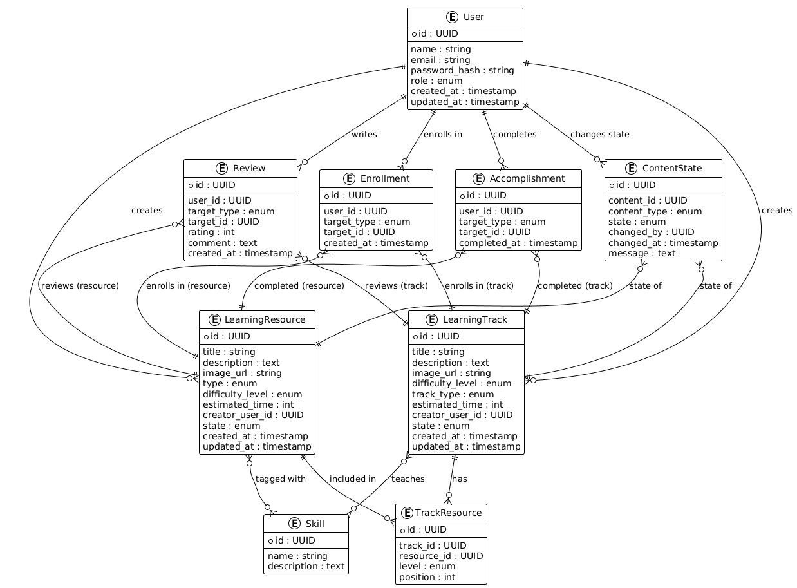

# 1. Overall System Description

The platform is a web-based learning environment where users can discover, follow, and create structured learning content. It serves three types of users: visitors, learners, and administrators and provides a unified place to explore materials, track learning progress, and publish user-generated content.

The system is built around two core content types:

- **Learning Resources**: individual items such as courses, books, articles, projects, and videos.  
- **Learning Tracks**: curated learning paths that combine multiple resources into organized levels.

Users can browse all published content, enroll in tracks or resources, and maintain a personalized space through **My Learnings**. A review system allows learners to rate and comment on content, helping others evaluate its quality.

Registered users can contribute new learning resources and tracks. They have full control over drafts, while publishing and deletion follow an admin approval workflow to maintain platform quality. Both creators and administrators receive notifications when content moves between states (draft, review, published/review).

Administrators review user submissions, handle deletion requests, and moderate reviews when necessary. They do not modify or override user-created content; their role is solely to ensure that public content meets the platform’s quality and relevance standards.

The platform supports skill tagging, search, filtering, and content sharing, enabling users to quickly find material aligned with their learning goals. A structured skill model connects resources and tracks to clear learning outcomes, improving content discovery and guidance.

In essence, the system enables users to learn, contribute, and navigate knowledge through organized, user-driven content supported by lightweight moderation and progress tracking.


Roles
-----
* Base Capabilities (applies to all roles)
    * Browse learning tracks and learning resources
    * Search and filter
    * View details, reviews, and learner counts
    * Share tracks or resources via public links

* Visitor (Not Logged In)
    * A Visitor has only the Base Capabilities.

* Registered User
    * A Registered User has all Visitor capabilities, plus:
        * Enroll in learning tracks or resources
        * Unenroll (remove items from “My Learnings”)
        * Create new learning tracks or resources (requires admin approval to publish)
        * Edit their own content
        * Request deletion of their published content (requires admin approval)
        * Rate and comment on items they created or enrolled in
        * Mark enrolled tracks or resources as completed
        * Receive in-app and email notifications
        * Access “My Learnings”
        * Access “Accomplishments”
        * Update their profile information (name, email, avatar)

* Admin
    * An Admin has all Registered User capabilities, plus:
        * Review user-submitted content and either approve it or request changes.
        * Review user delete requests and either approve, reject, or ask the content owner for clarification.
        * Create, edit, and delete their own learning content without approval.
        * Request modifications from content owners when quality or policy issues are found.

Concepts
--------
* User
* Learning Track
* Learning Resource
* Review
* Enrollment
* Notification
* Accomplishment
* Skill

Entities
-------
### User

```json
{
    "id": "UUID",
    "name": "string",
    "email": "string (unique)",
    "password_hash": "string",
    "role": "enum('registered', 'admin')",
    "created_at": "timestamp",
    "updated_at": "timestamp"
}
```

### Learning Track

```json
{
    "id": "UUID",
    "title": "string",
    "description": "text",
    "image_url": "string (optional)",
    "difficulty_level": "enum('beginner', 'intermediate', 'advanced')",
    "track_type": "enum('predefined', 'user_defined')",
    "estimated_time": "integer (optional; or computed)",
    "creator_user_id": "UUID (FK → User)",
    "state": "enum('draft', 'pending_review', 'published', 'rejected', 'pending_delete', 'deleted')"
    "created_at": "timestamp"
    "updated_at": "timestamp"
}
```

### Learning Resource

```json
{
    "id": "UUID",
    "title": "string",
    "description": "text",
    "image_url": "string (optional)",
    "type": "enum('course', 'book', 'project', 'article', 'talk')",
    "difficulty_level": "enum('beginner', 'intermediate', 'advanced')",
    "estimated_time": "integer  // in hours",
    "creator_user_id": "UUID (FK → User)",
    "state": "enum('draft', 'pending_review', 'published', 'rejected', 'pending_delete', 'deleted')",
    "created_at": "timestamp",
    "updated_at": "timestamp"
}
```

### skill

```json
{
    "id": "UUID",
    "name": "string (unique)",
    "description": "text (optional)",
    "created_at": "timestamp",
    "updated_at": "timestamp"
}
```

### Review

```json
{
    "id": "UUID"
    "user_id": "UUID (FK → User)"
    "target_type": "enum('track', 'resource')"
    "target_id": "UUID"  // refers to LearningTrack or LearningResource
    "rating": "integer" (1–5)
    "comment": "text"
    "created_at": "timestamp"
}
```
### Enrollment

```json
{
    "id: UUID"
    "user_id": "UUID" (FK → User)
    "target_type": "enum('track', 'resource')"
    "target_id: "UUID"
    "created_at": "timestamp"
}
```

### Notification

```json
{
    "id": "UUID"
    "user_id": "UUID" (FK → User)
    "type": "enum(
        'content_approved',
        'content_rejected',
        'delete_request_approved',
        'delete_request_rejected',
        'new_published_content',
        'new_interaction'
    )"
    "payload": "jsonb"  // contains details
    "is_read": "boolean"
    "created_at": "timestamp"
}
```

### Accomplishment

```json
{
    "id": "UUID"
    "user_id": "UUID" (FK → User)
    "target_type": "enum('track', 'resource')"
    "target_id": "UUID"
    "completed_at": "timestamp"
}
```

### Content State

```json
{
    "id": "UUID",
    "content_id": "UUID",
    "content_type": "enum('track', 'resource')",
    "state": "enum('draft', 'pending_review', 'published', 'rejected', 'pending_delete', 'deleted')",
    "changed_by": "UUID",
    "changed_at": "timestamp",
    "message": "text (optional)"
}
```
### Entity Relationship Diagram

